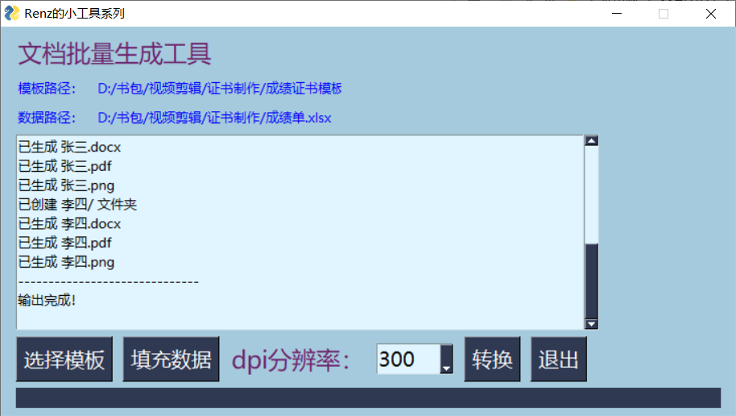

# fill_docx

> 一款基于excel数据批量自动填充word文档的小工具


## 开发背景

我们经常会面临批量生成文档的需求，可以使用word自带的邮件填充实现。但对于某些场景：如马拉松比赛成绩证书批量生成，要将文档转换为图片格式，会带来很大的工作量。

各种大型赛事公司想必都有自己的工具软件，但苦于没找到开源素材，所以只能自己动手用python搓了一个小工具。除了基于excel批量填充外，还包含了生成pdf和图片的功能。

## 使用方法

### 1. 安装python环境

- 可以基于anaconda创建虚拟环境，根据requirements.txt里面的第三方库包进行安装。

  ```shell
  conda create -n fill_docs python=3.11.2
  conda activate fill_docs
  pip install -r requirements.txt
  ```

- 然后直接运行即可

  ```shell
  python fill_docx.py
  ```

### 2. 使用打包好的程序

- 由于本工具使用的python第三方库比较多，目前使用pyinstaller打包比较大（200M左右）。链接：https://pan.baidu.com/s/1Ty7D6NP2M8T2ldugMWddPA 提取码: renz
- 下载好以后直接点击即可运行



## 注意事项

如下图所示，对应excel列名在word模板里需要

1. 用英文方括号 `[]` 括住

2. 单独放在一个文本框内，避免混乱
3. 文本框设置好字体字号颜色，最好设置居中以保证最佳效果


## 后续计划

- [ ] 设置输出文件夹可选——目前默认同目录
- [ ] 支持选择是否导出pdf与图片——目前默认全部导出
- [ ] 设置自定义命名项目（姓名、编号等）——目前默认第一列
- [ ] 研究Nuitka打包为轻量级快速exe